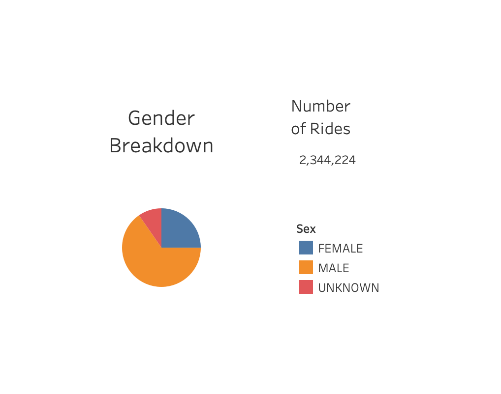
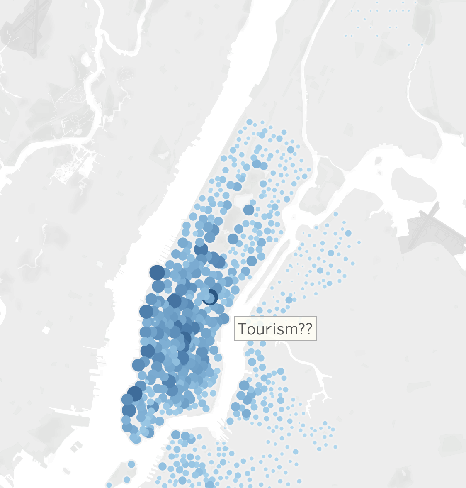
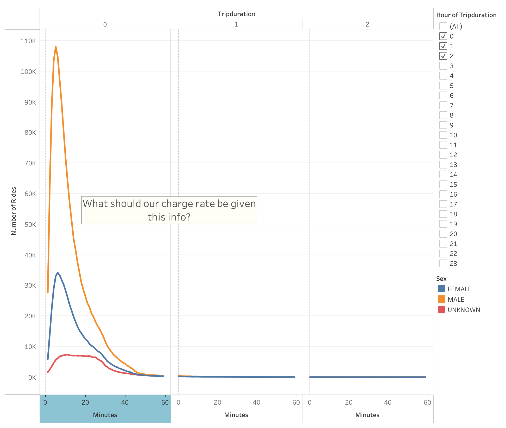
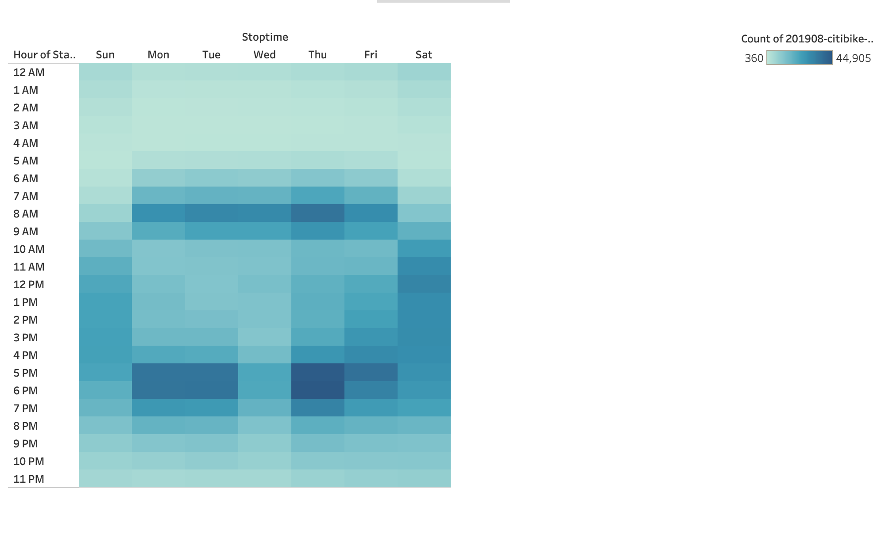
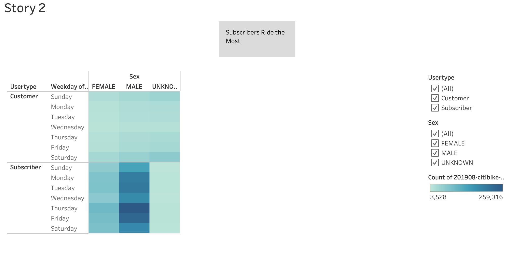

# Bikesharing

## Overview

This project analyzes NYC bikesharing data from a fictional company. The goal is to visualize this data in a manner that elucidates the likelihood of such a company succeeding in another city.  Here is the [link](https://public.tableau.com/views/NYC_Citi_Bike_Story_Final_Draft/Story5?:language=en-US&publish=yes&:display_count=n&:origin=viz_share_link) to the tableau workbook containing the final results. 

## Results

Here are the following conclusion from the data visualizations:

* The majority of riders are men
* NYC very popular area, could this be due to tourism?
* Average trip duration is usually less than 20 minutes
* Most rides occur during rush hour
* Most rides are from subscribers

These finding are illustrated in the following images:

## Conclusion

The NYC bikesharing service provide over 2 million rides, mostly by men. This service was in highest demand during the hour in which people arrive at and leave work. Most trips lasted less than 20 minutes, but some lasted over 30 minutes. Future work could visualize more data, such as average trip duration by start location. It would also be helpful to measure the actual distance of these trips rather than just the time. From this data, there is no reason why the bikesharing service would not be successful in other cities. 
